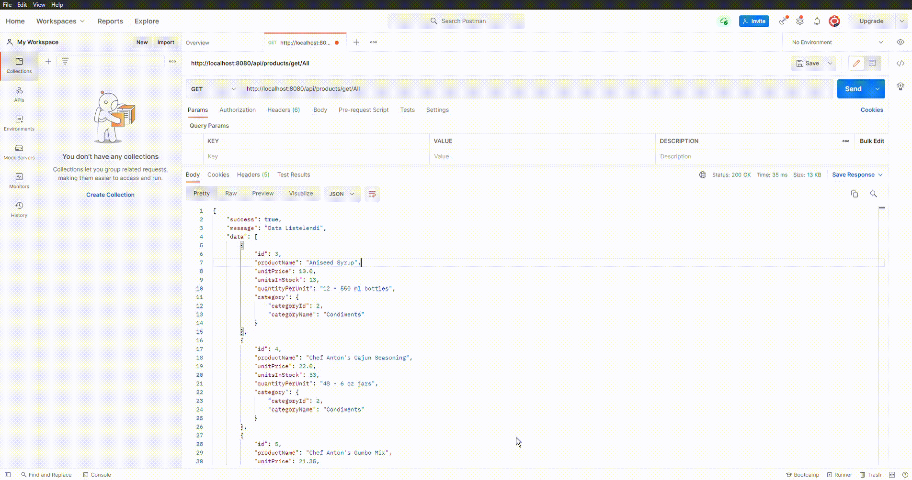

# Database-Script-Postgre-SQL

<h1>Uses Technologies</h1>
<h2>Spring Boot</h2>
<ul>
<li>Spring Boot 2.5.3</li>
<li>Java 16</li>
<li>Spring Boot</li>
<li>Lombok</li>
<li>Spring Web</li>
<li>Swagger</li>
<li>Spring Boot DevTools</li>
<li>Spring Boot Security</li>
<li>Spring Boot Validation</li>
<li>PostgreSQL Driver</li>
<li>Spring Data JPA</li>

<table>
<thead>
<tr>
<th>Swagger</th>
<th>Postman</th>
</tr>
</thead>
<tbody>
<tr>
<td></td>
<td></td>
</tr>
</tbody>
</table>
